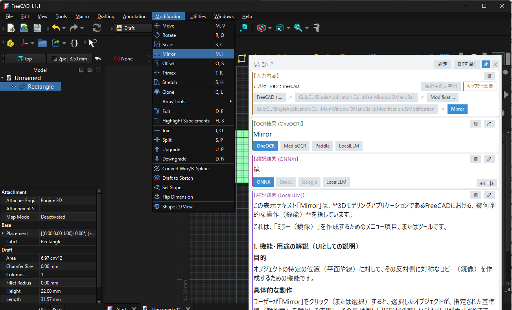
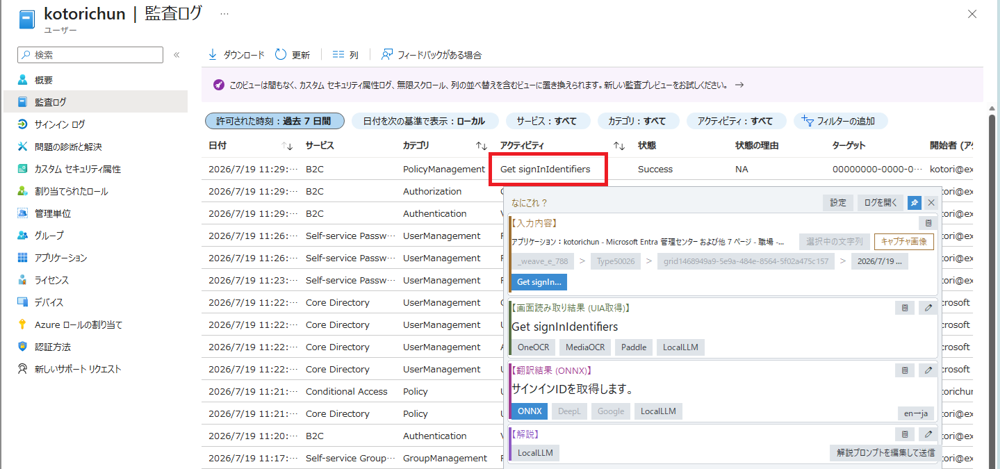
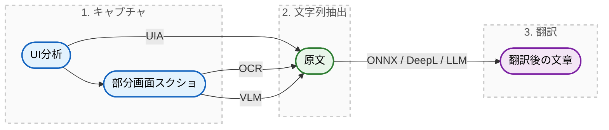
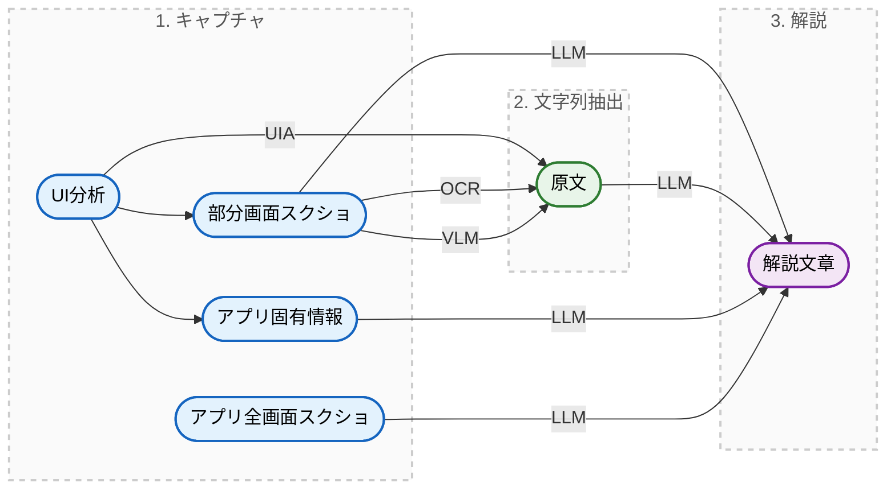
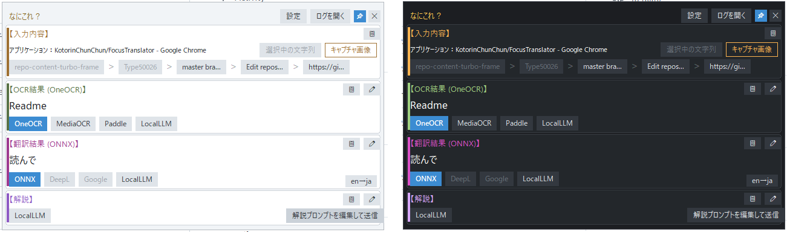
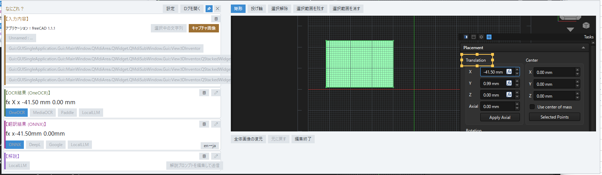
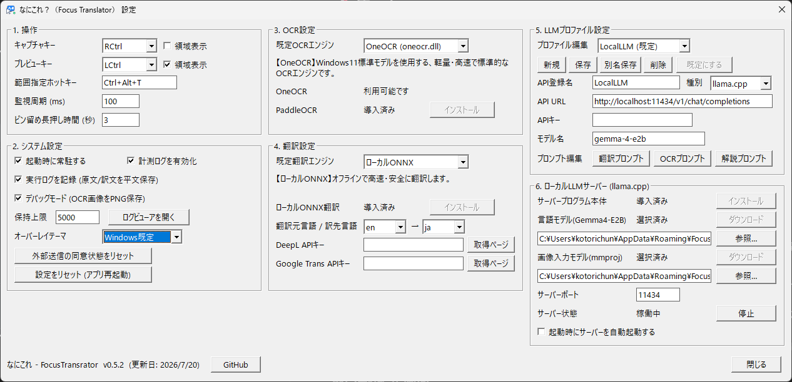
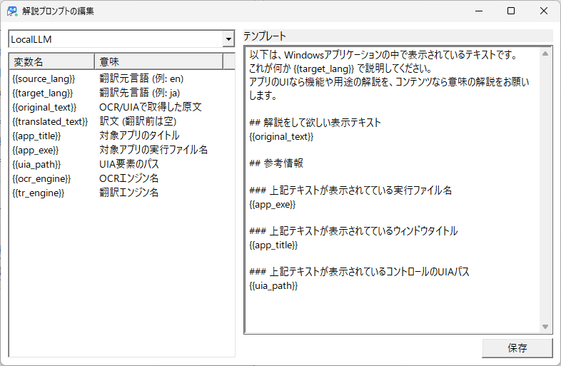
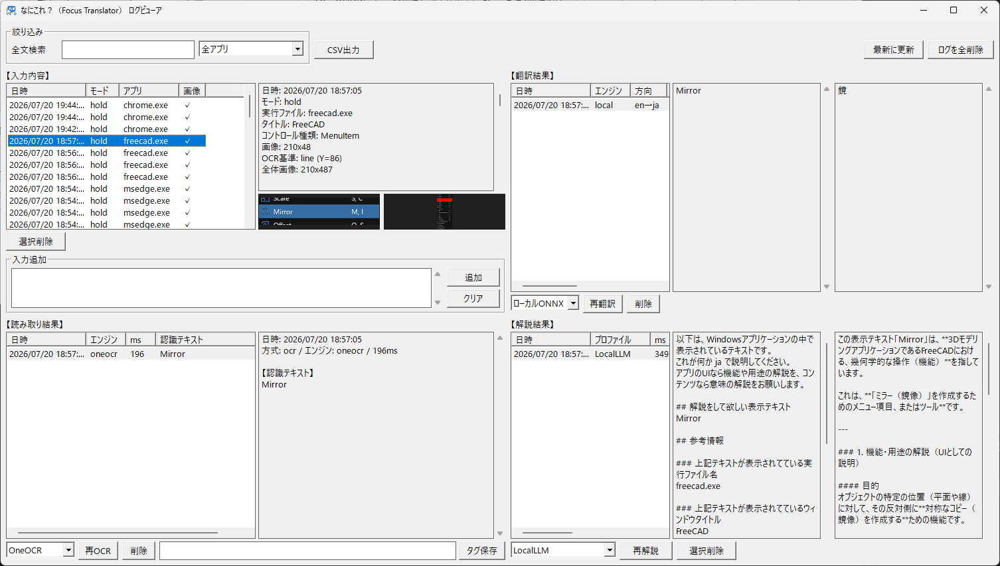

# なにこれ？（Focus Translator）

右Ctrlキーを押すとマウスポインタ直下のテキストを認識して、翻訳をカーソル周辺にオーバーレイ表示するWindows常駐ツールです。  
日本語にローカライズされていないソフトウェアやSaaSの管理画面のメニュー・ボタン・エラーメッセージなどの意味を即座に確認するために使用します。

## プロジェクト概要

海外製のSaaSやソフトウェアを使用する際、英語のメニューやボタン、エラーメッセージの意味がわからず、「テキストを選択してコピーし、ブラウザの翻訳ツールに貼り付ける」という作業を繰り返すことに煩わしさを感じていました。  
そこで、「『なにこれ？』と思った瞬間に、マウスカーソルが指している箇所をピンポイントで翻訳・解説してくれるツール」が欲しいと思い立ち本ツールを開発しました。

本プロジェクトの技術情報や開発向けのドキュメントは以下にまとめています。

- インストーラのビルド手順 : [BUILD.md](docs/BUILD.md)

## 仕組み

### 1. 翻訳文作成のフロー

### 2. 解説文作成のフロー

## ✨ 主な機能

初期設定では右Ctrlキーを押している間だけサッと翻訳が表示され、離せばすぐに元の作業に戻れます。画像化されていてコピーできないテキストであってもOCRで瞬時に読み取れます。テキストを選択した状態であれば、その選択文字列を最優先で採用します。さらに翻訳結果だけでは満足できない場合は、生成AIの力で画面の内容から解説までしてくれるため、翻訳ソフトよりも分かりやすい説明が期待できます。解説機能を実装したことで、日本語のアプリで使い方が分からないときにも活用できるようになりました。

| 機能                   | 説明                                                                                                                       |
| ---------------------- | -------------------------------------------------------------------------------------------------------------------------- |
| **即時キャプチャ**     | 右Ctrlキーを押している間、カーソル下のテキスト（テキスト選択中は選択部分を優先）をUIAやOCR等で取得します。離すと消えます。 |
| **範囲指定キャプチャ** | `Ctrl+Alt+T` で範囲指定モードを起動し、ドラッグ選択した矩形を画像化しOCR処理します。                                       |
| **画像編集**           | スクリーンショットから必要な範囲を切り抜いてOCRの認識範囲を変更します。                                                    |
| **翻訳**               | 原文のキャプチャに続けて、テキストを翻訳した結果を表示します。                                                             |
| **解説**               | 生成AI（LLM）の力で、単なる翻訳にはできない用語の詳細な意味や用途の解説を行います。対象箇所を赤枠で示したアプリ全体のスクリーンショットを添付し、画面の文脈を踏まえた解説が得られます。 |
| **ログ取得**           | 過去の履歴をツリー構造で振り返り、再処理やCSV出力を行えます。                                                              |
| **モデル切り替え**     | 設定画面から高精度なOCR（PaddleOCR）、クラウドのAPIサービス、ローカルLLM（ONNX / llama.cpp）を切り替えることができます。   |
| **LLMサーバー管理**    | ローカルLLMサービス（llama.cpp）を自身のパソコンに簡単に導入し、完全オフラインで動作させることができます。                 |

## 🖥️ 対応環境

- **OS**: Windows 10 / 11
- **必要要件**:
  - OneOCR (既定のOCRエンジン) は Windows 11 のみ対応。Windows 10 の場合は精度が悪い Windows.Media.Ocr を使うか、PaddleOCR をインストールしてください。

## 📦 インストール

本ツールはスタートアップ常駐を前提としています。以下の手順でインストールしてください。

1. [Releases](https://github.com/KotorinChunChun/FocusTranslator/releases) から `focus-translator-setup.exe` をダウンロードします。
2. インストーラを実行し、画面の指示に従ってインストールします。
   - 自動的にスタートアップに登録され、タスクトレイに常駐します。
3. アプリを起動すると、初回のみ高精度なローカルOCR(PaddleOCR)とローカル翻訳モデル(ONNX)の導入を促す案内ダイアログが表示されます。「はい」を選ぶと設定画面が開くので、各エンジンのインストールボタンから導入してください。
   - 導入しない場合、OCRはWindows標準機能で代替されますが、翻訳モデルは導入しないとローカルでの翻訳はできません。
4. 外部API(Gemini等)を利用する場合はAPIキーを自力で用意する必要があります。
   - 解説機能を使用するためには、LLMの設定が必須となります。
   - クラウドが利用できるなら、おすすめはGemini-3.5-flashです。（開発者向けの無料枠でも本アプリの利用には十分な性能です。）
   - 外部に一切データを送信しない運用をしたいならローカルLLMサービス（llama.cpp）を導入しましょう。
5. 設定画面でローカルLLMサービス（llama.cpp）を導入することができます。
   - 自動で導入するLLMおよびVLMはGoogleのGemma-4-E2Bに固定しています。
   - 導入するとストレージの容量を3.5GB程度消費し、快適に利用するにはそれなりのスペックが要求されます。（RAMが16GBある標準的なPCであればGPUが無くても動作はします）

※ 既定では設定ファイルやモデルは `%APPDATA%\FocusTranslator\` に保存されます。

## 🚀 使い方

### 基本操作

1. アプリを起動するとタスクトレイに常駐します。
2. 画面上のわからないテキストにマウスカーソルを合わせ、**右Ctrlキーをホールド（押しっぱなし）** します。
3. 翻訳結果がオーバーレイ表示されます。作業に戻る場合はキーを離すだけです。

### オーバーレイ画面（入力結果／翻訳結果表示）

キャプチャ直後にカーソル付近にポップアップするメイン画面です。

- **基本構成**: 上段に小さく「認識した原文」、下段に大きく「翻訳結果」を表示します。
- **チップ（ボタン群）**: 結果の下に並ぶボタンで、エンジン切替、解説（LLMによる詳細説明）、キャプチャ編集、コピーなどの操作が可能です。
- **解説結果のMarkdownプレビュー**: 解説結果は見出し・箇条書き・強調・コードブロックなどをそのまま整形して表示します（コピーボタンはMarkdown原文をコピーします）。
- **選択中の文字列優先**: テキストを選択した状態でキャプチャした場合、選択文字列をOCRより優先して自動採用します。手動での再採用や、ホバーによる全文確認も可能です。
- **配色テーマ**: 「Windows既定 / ライト / ダーク」から選択でき、既定ではWindowsのテーマ切替に自動追従します。

### キャプチャ編集画面

オーバーレイ画面の【キャプチャ画像】ボタンから展開する、インラインの画像編集機能です。  
自動検出されたキャプチャ範囲が不適切な場合に、投げ輪や矩形で必要な箇所を切り抜くことで、適切な部分のみをOCRで文字起こしできるようになります。

### 設定画面

タスクトレイメニューから開く、総合設定画面です。「1. 操作」「2. システム設定」「3. OCR設定」「4. 翻訳設定」「5. LLMプロファイル設定」「6. ローカルLLMサーバー (llama.cpp)」の6グループで構成されています。

- **操作・OCR設定**: ホットキーや既定OCRエンジンの選択。選択中のエンジンの特徴を説明する解説文がコンボ直下に表示されます。
- **翻訳設定**: 既定翻訳エンジン、APIキー（DeepL / Google / Gemini等）の設定。
- **LLMプロファイル設定**: 業務ドメインに合わせた解説用プロンプトをプロファイル単位で個別に設定可能。応答の最大トークン数もプロファイルごとに調整できます。任意のプロファイルを「既定にする」ことができ、右Ctrl/範囲指定の起動時に使用されます。
- **ローカルLLM(llama.cpp)**: llama.cpp本体とモデル（Gemma 4 E2B等）をワンクリックで導入し、サーバーの起動・停止・自動起動を行えます。さらにmmproj(画像入力対応用ファイル)を導入しておくと、ローカルLLMに画像ベースのOCRを行わせることも可能です。

### プロンプト編集とログビューアー画面

- **プロンプト編集**: `{{original_text}}` などの変数を活用し、LLMに送信する命令文を細かくカスタマイズできます。最前面表示の専用ウィンドウで、テンプレート編集と送信内容プレビューを分離して扱えます。
- **ログビューアー**: 過去の業務中の翻訳履歴をツリー構造で振り返り、再処理やCSV出力が行えます。履歴はローカルのSQLiteに安全に保存されます。

## ⚙️ 各種エンジンの対応状況

**OCRエンジン対応状況**

| エンジン                          | 種別          | 条件                             |
| --------------------------------- | ------------- | -------------------------------- |
| OneOCR (oneocr.dll)               | OCR (既定)    | Windows 11のみ対応               |
| Windows.Media.Ocr                 | OCR           | Windows 10, 11対応               |
| PaddleOCR                         | OCR           | 要インストール                   |
| クラウドLLM (Gemini, Claude, GPT) | OCR+翻訳+解説 | 要APIキー                        |
| ローカルLLM (llama.cpp)           | OCR+翻訳+解説 | 要インストール＆サーバー実行 (※) |

_(※) ローカルLLMでOCRを行う場合は、設定画面「6. ローカルLLM」からmmprojファイルを追加導入した上でサーバーを起動してください。_

**翻訳エンジン対応状況**

| エンジン                          | 種別          | 条件                         |
| --------------------------------- | ------------- | ---------------------------- |
| ローカルONNX                      | 翻訳 (既定)   | 要インストール               |
| DeepL                             | 翻訳          | 要APIキー                    |
| Google翻訳                        | 翻訳          | 要APIキー                    |
| クラウドLLM (Gemini, Claude, GPT) | OCR+翻訳+解説 | 要APIキー                    |
| ローカルLLM (llama.cpp)           | OCR+翻訳+解説 | 要インストール＆サーバー実行 |

## 🛡️ プライバシーとセキュリティ

本アプリはパソコン上の画面を取得するという性質上、業務利用も想定してセキュリティに最大限配慮しています。

- 既定構成 (Windows OCR + ローカル翻訳) では**外部へのデータ送信は一切行われません**。
- クラウドAPI（Gemini, DeepL等）を利用する際は、初回送信時にユーザーの同意ダイアログを表示し、許可を得た場合のみ送信します。同意が無い場合は代替送信を行わず、処理自体を実行しません。
- ローカルLLM（llama.cpp等、localhostを指すプロファイル）への送信はPC外へのデータ送信に該当しないため、同意なしで利用できます。
- 登録されたAPIキー等の機密情報は、Windowsの DPAPI（Data Protection API）で暗号化してローカルに保存され、ログ出力時には必ずマスクされます。
- 既定の設定ではログを取得しません。設定画面から必要に応じて取得するように変更できます。また、任意のタイミングでログを削除することも可能です。

## 利用条件

- 本ツールはフリーウェアです。無制限にご利用頂けます。
- クラウドサービスを使用したことによる情報流出や、その後の利用に関する制限は、利用者の責任において管理されるものとします。
- 本ツールを使用したことにより発生したいかなる損害も作者は責任を負いません。
- バグや追加して欲しい機能などがあれば、GitHubのIssuesやTwitterなどでお声掛けください。

## 👤 作者

**ことりちゅん** ([@KotorinChunChun](https://github.com/KotorinChunChun))
