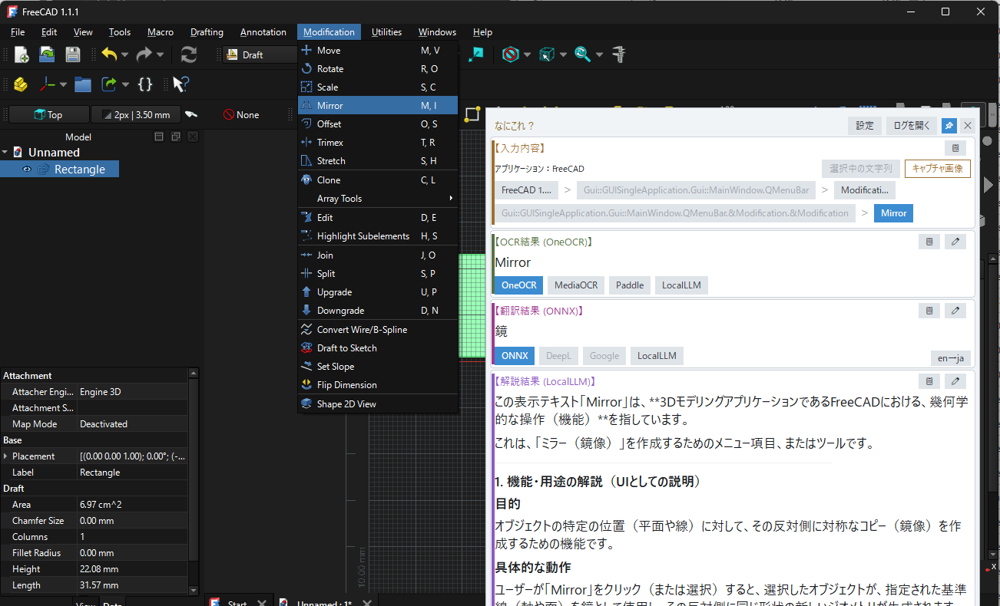
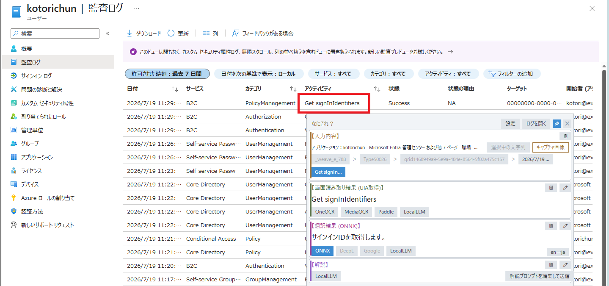
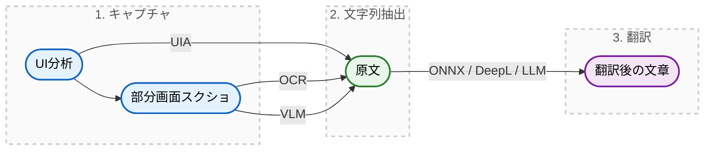
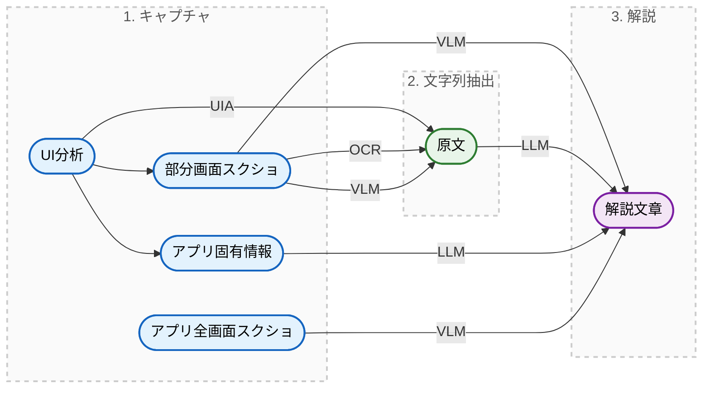
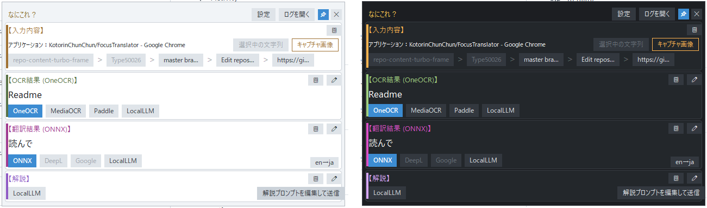
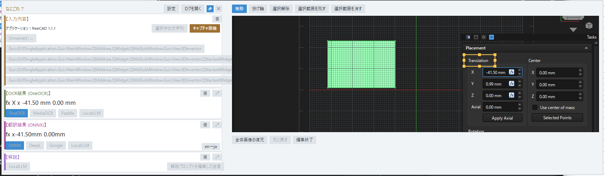
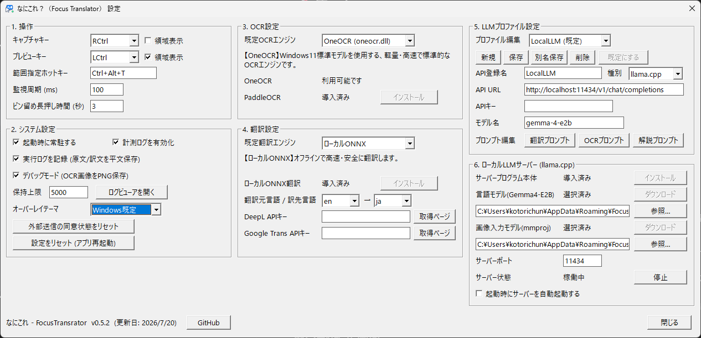
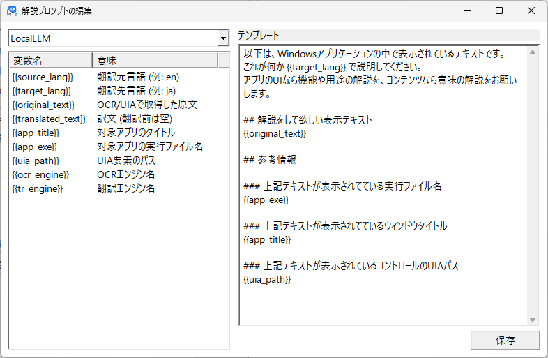
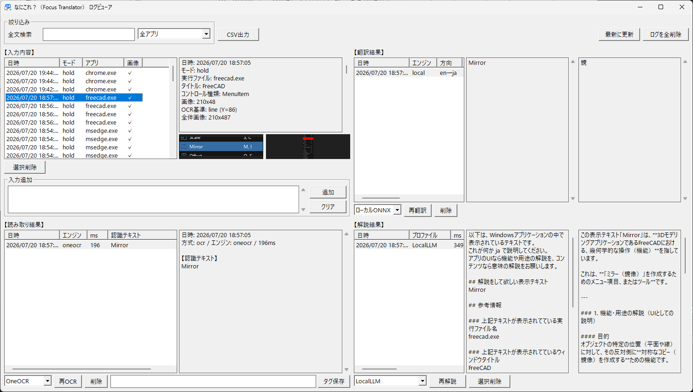

# なにこれ？（Focus Translator）

マウスポインタ直下のテキストを認識して、翻訳や解説をポップアップで表示するWindows用の常駐ツールです。

このドキュメントの対応バージョン: **v0.5.6**

---

## 📑 目次

- [💡 プロジェクト概要](#-プロジェクト概要)
- [🧠 仕組み（アーキテクチャ）](#-仕組みアーキテクチャ)
- [✨ 主な機能](#-主な機能)
- [🖥️ 対応環境](#️-対応環境)
- [📦 インストール](#-インストール)
- [🗑️ アンインストール](#️-アンインストール)
- [🚀 使い方](#-使い方)
  - [基本操作](#基本操作)
  - [オーバーレイ画面](#オーバーレイ画面入出力結果表示)
  - [キャプチャ編集画面](#キャプチャ編集画面)
  - [設定画面](#設定画面)
  - [プロンプト編集](#プロンプト編集)
  - [ログビューアー画面](#ログビューアー画面)
- [⚙️ 各種エンジンの対応状況](#️-各種エンジンの対応状況)
- [🛡️ プライバシーとセキュリティ](#️-プライバシーとセキュリティ)
- [📄 利用条件](#-利用条件)
- [👤 作者](#-作者)

---

## 💡 プロジェクト概要

海外製のソフトウェアを使用する際、英語のメニューやボタン、エラーメッセージの意味がわからず、「テキストやスクショをコピーして翻訳サイトやチャットAIに貼り付ける」という作業を繰り返すことに煩わしさを感じていました。  
そこで、「『なにこれ？』と思った瞬間に、マウスカーソルが指している箇所をピンポイントで翻訳・解説してくれるツール」が欲しいと思い立ち本ツールを開発しました。

本プロジェクトのビルド手順やカスタマイズ方法、開発向けドキュメントは以下にまとめています。

- 🛠️ **ビルド & カスタマイズガイド** : [BUILD_AND_CUSTOMIZE.md](docs/BUILD_AND_CUSTOMIZE.md)

## 仕組み

### 1. 翻訳文作成のフロー

```mermaid
flowchart LR
    subgraph Capture [1. キャプチャ]
        direction TB
        UI([UI分析])
        Screen([部分画面スクショ])
        UI --> Screen
    end

    subgraph Extraction [2. 文字列抽出]
        direction TB
        Text([原文])
    end

    subgraph TranslationGroup [3. 翻訳]
        direction TB
        Translation([翻訳後の文章])
    end

    %% フローの接続（抽出）
    UI -- UIA --> Text
    Screen -- OCR --> Text
    Screen -- VLM --> Text

    %% フローの接続（翻訳）
    Text -- ONNX / DeepL / LLM --> Translation

    %% スタイルの調整
    classDef capture fill:#e3f2fd,stroke:#1565c0,stroke-width:2px,color:#000;
    classDef extract fill:#e8f5e9,stroke:#2e7d32,stroke-width:2px,color:#000;
    classDef ai fill:#f3e5f5,stroke:#7b1fa2,stroke-width:2px,color:#000;

    class UI,Screen capture;
    class Text extract;
    class Translation ai;

    %% サブグラフの背景スタイル
    style Capture fill:#fafafa,stroke:#ccc,stroke-width:2px,stroke-dasharray: 5 5,color:#555
    style Extraction fill:#fafafa,stroke:#ccc,stroke-width:2px,stroke-dasharray: 5 5,color:#555
    style TranslationGroup fill:#fafafa,stroke:#ccc,stroke-width:2px,stroke-dasharray: 5 5,color:#555
```

### 2. 解説文作成のフロー

```mermaid
flowchart LR
    subgraph Capture [1. キャプチャ]
        direction TB
        UI([UI分析])
        Env([アプリ固有情報])
        Screen([部分画面スクショ])
        FullScreen([アプリ全画面スクショ])
        UI --> Env
        UI --> Screen
    end

    subgraph Extraction [2. 文字列抽出]
        direction TB
        Text([原文])
    end

    subgraph ExplanationGroup [3. 解説]
        direction TB
        Explanation([解説文章])
    end

    %% フローの接続（抽出）
    UI -- UIA --> Text
    Screen -- OCR --> Text
    Screen -- VLM --> Text

    %% フローの接続（解説）
    Screen -- VLM --> Explanation
    Text -- LLM --> Explanation
    Env -- LLM --> Explanation
    FullScreen -- VLM --> Explanation

    %% スタイルの調整
    classDef capture fill:#e3f2fd,stroke:#1565c0,stroke-width:2px,color:#000;
    classDef extract fill:#e8f5e9,stroke:#2e7d32,stroke-width:2px,color:#000;
    classDef ai fill:#f3e5f5,stroke:#7b1fa2,stroke-width:2px,color:#000;

    class UI,Screen,Env,FullScreen capture;
    class Text extract;
    class Explanation ai;

    %% サブグラフの背景スタイル
    style Capture fill:#fafafa,stroke:#ccc,stroke-width:2px,stroke-dasharray: 5 5,color:#555
    style Extraction fill:#fafafa,stroke:#ccc,stroke-width:2px,stroke-dasharray: 5 5,color:#555
    style ExplanationGroup fill:#fafafa,stroke:#ccc,stroke-width:2px,stroke-dasharray: 5 5,color:#555
```

## ✨ 主な機能

初期設定では右Ctrlキーを押している間だけサッと翻訳が表示され、離せばすぐに元の作業に戻れます。

画像化されていてコピーできないテキストであってもOCRで瞬時に読み取れます。

テキストを選択した状態であれば、その選択文字列を最優先で採用します。

さらに翻訳結果だけでは満足できない場合は、生成AIの力で画面の内容から解説までしてくれるため、翻訳ソフトよりも分かりやすい説明が期待できます。

解説機能を実装したことで、日本語のアプリで使い方が分からないときにも活用できるようになりました。

| 機能                   | 説明                                                                                                                                                                                    |
| ---------------------- | --------------------------------------------------------------------------------------------------------------------------------------------------------------------------------------- |
| **即時キャプチャ**     | 右Ctrlキーを押している間、カーソル下のテキスト（テキスト選択中は選択部分を優先）をUIAやOCR等で取得します。離すと消えます。                                                              |
| **範囲指定キャプチャ** | `Ctrl+Alt+Shift+T` で範囲指定モードを起動し、ドラッグ選択した矩形を画像化しOCR処理します。選択中は重ねて起動せず、ESCで閉じられます。                                             |
| **クリップボード取込** | コピー中のテキストや画像をボタンクリックで取り込みます。リッチテキストはMarkdownへ変換し、プレーンテキストは空白や改行を保って取り込みます。                                     |
| **画像編集**           | スクリーンショットから必要な範囲を切り抜いてOCRの認識範囲を変更します。                                                                                                                 |
| **翻訳**               | 原文のキャプチャに続けて、テキストを翻訳した結果を表示します。                                                                                                                          |
| **解説**               | 生成AI（LLM）の力で、単なる翻訳にはできない用語の詳細な意味や用途の解説を行います。全体スクリーンショット送信を有効にすると、対象箇所を赤枠で示した画像から画面の文脈を踏まえた解説が得られます。 |
| **ログ取得**           | 過去の履歴をツリー構造で振り返り、再処理やCSV出力を行えます。                                                                                                                           |
| **モデル切り替え**     | 設定画面から高精度なOCR（PaddleOCR）、クラウドのAPIサービス、ローカルLLM（ONNX / llama.cpp）を切り替えることができます。                                                                |
| **LLMサーバー管理**    | ローカルLLMサービス（llama.cpp）を自身のパソコンに簡単に導入し、完全オフラインで動作させることができます。                                                                              |

## 🖥️ 対応環境

- **OS**: Windows 10 / 11
- **必要要件**:
  - OneOCR (既定のOCRエンジン) は Windows 11 のみ対応。Windows 10 の場合は精度が悪い Windows.Media.Ocr を使うか、PaddleOCR をインストールしてください。

## 📦 インストール

本ツールはスタートアップ常駐を前提としています。以下の手順でインストールしてください。

1. [Releases](https://github.com/KotorinChunChun/FocusTranslator/releases) から `focus-translator-setup.exe` をダウンロードします。
2. インストーラを実行し、画面の指示に従ってインストールします。
   - 自動的にスタートアップに登録され、タスクトレイに常駐します。
3. アプリを起動すると、初回のみ高精度なローカルOCR(PaddleOCR)とローカル翻訳モデル(ONNX)の導入を促す案内ダイアログが表示されます。「はい」を選ぶと設定画面が開くので、各エンジンのインストールボタンから導入してください。
   - 導入しない場合、OCRはWindows標準機能で代替されますが、翻訳モデルは導入しないとローカルでの翻訳はできません。
4. 外部の生成AIを利用する場合は、APIキーを用意するか、対応するCLIを導入し、利用者自身のアカウントで各CLIへサインインします。
   - 解説機能を使用するためには、LLMの設定が必須となります。
   - クラウドが利用できる場合は、GeminiやGPTを契約してAPIキーを入手し、設定画面から設定してください。
   - Codex CLI / Claude CLI / GitHub Copilot CLI / Gemini CLI / Kimi Code CLIは、各CLIを別途インストールし、利用者自身のアカウントでサインインすると、APIキーを登録せずにOCR・翻訳・解説へ利用できます。各社の利用上限や追加課金設定は、ご利用中のプランに従います。
   - 外部に一切データを送信しない運用をしたい場合は、ローカルLLMサービス（llama.cpp）を導入しましょう。
5. 設定画面でローカルLLMサービス（llama.cpp）を導入することができます。
   - 自動で導入するLLMおよびVLMはGoogleのGemma-4-E2Bに固定しています。
   - 導入するとストレージの容量を3.5GB程度消費し、快適に利用するにはそれなりのスペックが要求されます。（RAMが16GBある今どきのPCであればGPUが無くても動作します）
   - 本ツールは汎用性を重視しています。GPUを活かせるサーバーを立てたい場合は、自力で立ててください。

※ 既定では設定ファイルやモデルは `%APPDATA%\FocusTranslator\` に保存されます。

## 🗑️ アンインストール

Windowsの「アプリと機能」からアンインストールできます。アンインストール時は自動的に本ツールを終了し、起動中であればローカルLLMサーバー（llama.cpp）も停止します。続けて、本ツールが作成したデータ（ログ・翻訳モデル・LLMサーバーとモデル・設定など、`%APPDATA%\FocusTranslator\` 配下一式）をすべて削除するかどうかの確認が表示されます。「いいえ」を選んだ場合、データはそのまま残ります。

## 🚀 使い方

### 基本操作

1. 画面上の意味を確認したい英単語やテキストにマウスカーソルを合わせます。
2. **右Ctrlキーを長押し（ホールド）** します。
   - カーソル直下のテキストが自動認識され、マウス付近に翻訳画面がポップアップ表示されます。
3. **キーを離せば、翻訳画面がサッと消えて** すぐに元の作業に戻れます。

> 💡 **操作のコツ**:
>
> - **テキスト選択中の優先認識**: テキストの一部を選択した状態で右Ctrlを押すと、その選択文字列を最優先で認識します。
> - **範囲指定モード**: 広い領域をドラッグで指定して画像化・OCRしたい場合は、設定した範囲指定ホットキーを押します。選択中の再起動は抑止され、ESCでキャンセルできます。

---

### オーバーレイ画面（入出力結果表示）

キャプチャした直後にカーソル付近にポップアップするメイン画面です。

#### 画面構成

上から順に次の4つのエリアで構成されています。

1. 入力エリア (UIの分析結果、スクリーンショット画像)
2. 原文エリア (OCR結果、UIテキスト、クリップボード)
3. 翻訳エリア
4. 解説エリア

各エリアの右上には **【コピー】ボタン** があります。認識されたUIA情報、原文、翻訳文、解説文などをクリップボードへコピーできます。

#### 📥 1. 入力エリア (UIの分析結果、スクリーンショット画像)

- 右Ctrl長押し時に、画面のUI構造分析（UIA）やカーソル周辺のスクリーンショット画像を自動取得してインプットとします。
- テキスト選択部分や `Ctrl + Alt + T` での範囲指定、およびクリップボード内のテキスト/画像もこの入力エリアに取り込まれます。
- **【キャプチャ画像】ボタン**: 認識範囲が不適切な場合に画面を拡大表示し、投げ輪や矩形で切り抜いて再文字起こし（OCR）できます。
- **【コピー中の内容】ボタン**: クリップボードにテキストや画像がある場合に有効化され、新しい入力として直接取り込み・翻訳できます。HTMLやRTFのリッチテキストは見出し・強調・リンク・リストなどをMarkdownへ変換し、プレーンテキストは空白や改行を保って取り込みます。

#### 🔍 2. 原文エリア (OCR結果、UIテキスト、クリップボード)

- 入力エリアから自動文字起こし（OCR）やテキスト抽出された**英語の原文**が表示されます（画面上部の小さな枠）。
- マウスホバーで拡大全文を確認できるほか、テキスト選択時キャプチャの場合は選択範囲が優先表示されます。
- **各種ボタン**: クリックすると対象のOCRエンジンを用いて、再度の文字起こしを試みます。LLMプロファイルのボタンはマウスを乗せると、そのプロファイルへの直近1時間の送信回数・合計トークン数がツールチップで表示されます。
- OCRエンジンの性質で入力内容によっては認識精度が著しく低下することがあります。そのような場合は、【キャプチャ画像】ボタンにて対象の画像を削ることが必要です。
- LLMを設定している場合はLLM(VLM)を使用することで生成AIによる高い精度の文字起こしが可能です。（ただし非常に低速です）

#### 🌐 3. 翻訳エリア

- 既定の翻訳エンジンを用いて翻訳された**日本語訳**が表示されます。
- **各種ボタン**: クリックすると対象の翻訳エンジンを用いて、再度の翻訳を試みます。LLMプロファイルのボタンはマウスを乗せると使用状況がツールチップで表示されます。
- 翻訳エンジンの性質で入力内容によっては、おかしな翻訳が行われることがあります。そのような場合は、精度の高い翻訳を行うにはLLMの使用を推奨します。（ただし非常に低速です）

#### 🤖 4. 解説エリア

- 生成AI（LLM/VLM）で入力したテキスト及び画像から、言葉の意味やアプリのUIを詳しく解説する領域です。
- 過去に同じ内容を解説した履歴があれば自動プレビューされます。
- **各種ボタン**: クリックすると対応するプロファイルを用いて、生成AIへ詳細解説を問い合わせます。マウスを乗せると使用状況がツールチップで表示されます。
- **【解説プロンプトを編集して送信】ボタン**: クリックするとプロンプト編集画面を開きます。

#### 🎨 その他

- **【設定 ⚙️】ボタン**: 設定画面を開くことができます。
- **【ログ 📜】ボタン**: ログビューアー画面を開くことができます。
- **カラーテーマ**: 設定画面にて「Windows既定 / ライト / ダーク」から選択できます。

---

### キャプチャ編集画面

オーバーレイ画面の【キャプチャ画像】ボタンから展開する、インラインの画像編集機能です。  
自動検出されたキャプチャ範囲が不適切な場合に、投げ輪や矩形で必要な箇所を切り抜くことで、適切な部分のみをOCRで文字起こしできるようになります。

### 設定画面

タスクトレイアイコンを左クリックすると開く、総合設定画面です（右クリックでは従来通りメニューが表示されます）。「1. 操作」「2. システム設定」「3. OCR設定」「4. 翻訳設定」「5. LLMプロファイル設定」「6. ローカルLLMサーバー (llama.cpp)」の6グループで構成されています。

- **操作・OCR設定**: ホットキーや既定OCRエンジンの選択。プレビューキーの既定値は「なし」で、必要な場合だけキーを割り当てます。選択中のエンジンの特徴を説明する解説文がコンボ直下に表示されます。【アプリ別の動作設定】ボタンから別窓を開くと、「OCR優先アプリリスト」と「実行しないアプリリスト」を管理できます。前者は常に画面認識（OCR）を使い、後者ではホットキー処理を行いません。登録済み項目は中央の【→ 移動】【← 移動】で反対側へ移せます。追加は起動中アプリ・exe名の直接入力・対象ウィンドウ指定に対応し、【↓追加】で確定、【↑削除】で解除します。
- **システム設定**: 【アプリ全体のスクリーンショットをLLMに送信する】は既定でOFFです。ONにすると、対象箇所を赤枠で囲ったアプリ全体の画像をLLMによる文字起こし・翻訳・解説へ添付し、画面全体の文脈を利用できます。全体画像または対象位置を取得できない場合は、従来どおり対象画像またはテキストだけで処理します。【BossGuard（アプリ名・開発者名を隠す）】を有効にすると、タイトルバー・設定画面・オーバーレイ・ログビューアに表示されるFocusTranslator自身の名称と開発者名を空白表示にできます。対象アプリ名、機能名、バージョン、更新日はそのまま表示されます。
- **翻訳設定**: 既定翻訳エンジン、APIキー（DeepL / Google / Gemini等）の設定。
- **LLMプロファイル設定**: 種別はクラウド／ローカルAPIに加え、Codex CLI / Claude CLI / GitHub Copilot CLI / Gemini CLI / Kimi Code CLIから選択できます。【モデル取得】を押すと、そのAPIまたはCLIで利用できるモデル候補がモデル名のプルダウンへ反映されます。モデル名は候補から選ぶだけでなく自由入力も可能です。CLIの軽量な初期モデルは順に `gpt-5.6-luna` / `haiku` / `claude-haiku-4.5` / `gemini-2.5-flash-lite` / `k3-256k` です。CLI選択時はAPIキーと最大Token、APIキー不要のローカル種別ではAPIキーなど、使用しない欄がグレーアウトします。CLIの実行ファイルはPATHから自動検出され、必要な場合だけ「接続先 / CLI」へ手動指定できます。インストールとログインは各CLI側で行ってください。各入力はフォーカスを外すと自動保存されます。「複製」と「既定にする」も利用できます。

> **CLI利用時の注意:** FocusTranslatorから各CLIへサインインすることはできません。利用者自身のアカウントを使い、あらかじめ各CLIの画面またはコマンドでサインインしてから、そのサインイン済みCLIをFocusTranslatorで自動検出または「接続先 / CLI」へ指定して使用してください。

- **ローカルLLM(llama.cpp)**: llama.cpp本体とモデル（Gemma 4 E2B等）をワンクリックで導入し、サーバーの起動・停止・自動起動を行えます。インストール時にはCPU版・CUDA版(NVIDIA GPU)・Radeon版(AMD GPU)から選択でき、お使いの環境で検出したGPUに応じて推奨マークが表示されます。導入済みのビルド種別はいつでも確認でき、不要になれば停止して削除することも可能です。サーバーの既定ポートは11430です。さらにmmproj(画像入力対応用ファイル)を導入しておくと、ローカルLLMに画像ベースのOCRを行わせることも可能です。モデル/mmprojファイルが既定の保存先に既に存在する場合は、次回起動時にパス欄へ自動的に入力されます。

### プロンプト編集

プロンプト編集画面では、`{{original_text}}` などの変数を活用し、LLMに送信する命令文を細かくカスタマイズできます。最前面表示の専用ウィンドウで、テンプレート編集と送信内容プレビューを分離して扱えます。【アプリ全体のスクリーンショットをLLMに送信する】がONで送信画像を取得できた場合は、【再生成】の左にある【画像を開く】から、実際に送信する赤枠付き画像を確認できます。設定がOFFの場合や画像を取得できなかった場合、このボタンは無効になります。

### ログビューアー画面

ログビューアー画面では、本ツールの入出力履歴をツリー構造で振り返り、再処理やCSV出力が行えます。履歴はローカルのSQLiteに安全に保存されます。

## ⚙️ 各種エンジンの対応状況

**OCRエンジン対応状況**

| エンジン                          | 種別          | 条件                             |
| --------------------------------- | ------------- | -------------------------------- |
| OneOCR (oneocr.dll)               | OCR (既定)    | Windows 11のみ対応               |
| Windows.Media.Ocr                 | OCR           | Windows 10, 11対応               |
| PaddleOCR                         | OCR           | 要インストール                   |
| クラウドLLM (Gemini, Claude, GPT, Hugging Face, OpenRouter, GitHub Models, NVIDIA NIM) | OCR+翻訳+解説 | 要APIキー |
| ログイン済みLLM CLI (Codex, Claude, GitHub Copilot, Gemini, Kimi Code) | OCR+翻訳+解説 | 各CLIの導入・ログインが必要 |
| ローカルLLM (llama.cpp)           | OCR+翻訳+解説 | 要インストール＆サーバー実行 (※) |
| ローカルLLM (Ollama, LM Studio)   | OCR+翻訳+解説 | 別途導入・起動が必要 (APIキー不要) |

_(※) ローカルLLMでOCRを行う場合は、設定画面「6. ローカルLLM」からmmprojファイルを追加導入した上でサーバーを起動してください。_

**翻訳エンジン対応状況**

| エンジン                          | 種別          | 条件                         |
| --------------------------------- | ------------- | ---------------------------- |
| ローカルONNX                      | 翻訳 (既定)   | 要インストール               |
| DeepL                             | 翻訳          | 要APIキー                    |
| Google翻訳                        | 翻訳          | 要APIキー                    |
| クラウドLLM (Gemini, Claude, GPT, Hugging Face, OpenRouter, GitHub Models, NVIDIA NIM) | OCR+翻訳+解説 | 要APIキー |
| ログイン済みLLM CLI (Codex, Claude, GitHub Copilot, Gemini, Kimi Code) | OCR+翻訳+解説 | 各CLIの導入・ログインが必要 |
| ローカルLLM (llama.cpp)           | OCR+翻訳+解説 | 要インストール＆サーバー実行 |
| ローカルLLM (Ollama, LM Studio)   | OCR+翻訳+解説 | 別途導入・起動が必要 (APIキー不要) |

## 🛡️ プライバシーとセキュリティ

本アプリはパソコン上の画面を取得するという性質上、業務利用も想定してセキュリティに最大限配慮しています。

- 既定構成 (Windows OCR + ローカル翻訳) では**外部へのデータ送信は一切行われません**。
- クラウドAPI（Gemini, DeepL等）を利用する際は、初回送信時にユーザーの同意ダイアログを表示し、許可を得た場合のみ送信します。同意が無い場合は代替送信を行わず、処理自体を実行しません。
- 【アプリ全体のスクリーンショットをLLMに送信する】は既定でOFFです。ONにした場合は赤枠外を含む対象アプリ全体の表示内容も送信対象になるため、機密情報が映り込んでいないことを確認してご利用ください。外部サービスへ画像を初めて送る際は、画像送信についても同意を確認します。
- LLM CLIを利用する場合も入力テキストや画像は各社サービスへ送信されるため、クラウドAPIと同じ同意確認の対象です。CLIはリクエストごとの一時フォルダで起動し、利用可能な範囲でファイル変更・シェル実行・Web検索を無効化します。一時ファイルは処理後に削除されます。
- ローカルLLM（llama.cpp等、localhostを指すプロファイル）への送信はPC外へのデータ送信に該当しないため、同意なしで利用できます。
- 登録されたAPIキー等の機密情報は、Windowsの DPAPI（Data Protection API）で暗号化してローカルに保存され、ログ出力時には必ずマスクされます。
- 既定の設定ではログを取得しません。設定画面から必要に応じて取得するように変更できます。また、任意のタイミングでログを削除することも可能です。

---

## 📄 利用条件

- 本ツールはフリーウェアです。無制限にご利用頂けます。
- クラウドサービスを使用したことによる情報流出や、その後の利用に関する制限は、利用者の責任において管理されるものとします。
- 本ツールを使用したことにより発生したいかなる損害も作者は責任を負いません。
- バグや追加して欲しい機能などがあれば、GitHubのIssuesやTwitterなどでお声掛けください。

---

## 👤 作者

**ことりちゅん** ([@KotorinChunChun](https://github.com/KotorinChunChun))
